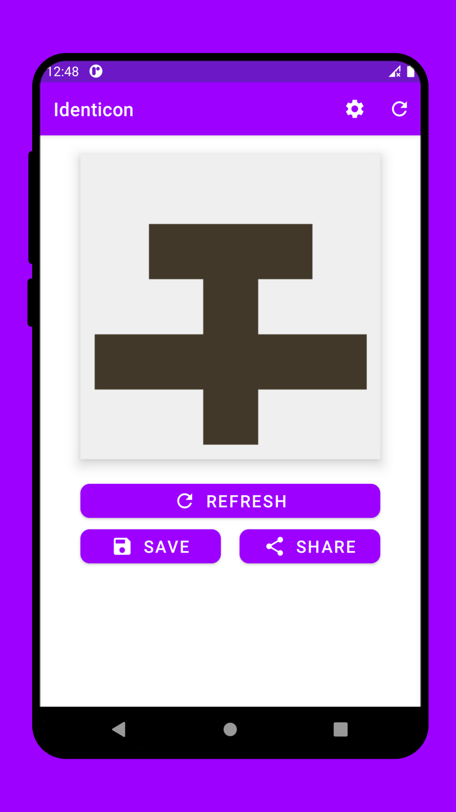
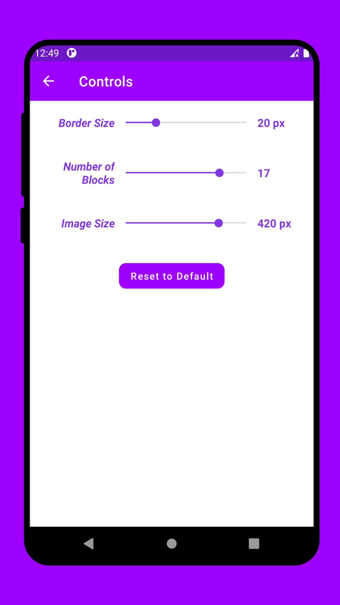
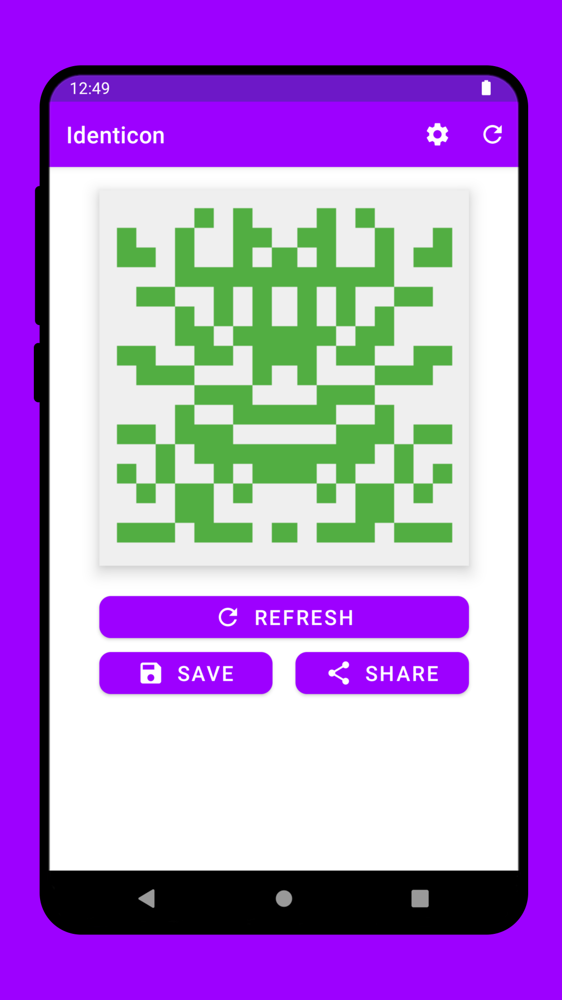
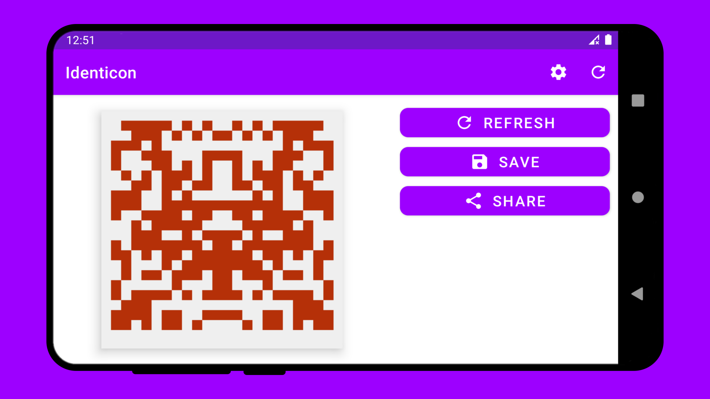

# Identicons

----

<table>
    <tr>
        <th>Title</th>
        <td>Identicons</td>
    </tr>
    <tr>
        <th>Short description</th>
        <td>Random Images which can be used as profile images. Similar to Github</td>
    </tr>
    <tr>
        <th>Full description</th>
        <td> Github style Identicons   This is an open source application. You can view its source code on github <a href="https://github.com/kashew-developers/Identicon">kashew-developers/Identicon</a></td>
    </tr>
    <tr>
        <th>YouTube</th>
        <td>https://youtu.be/W4BNGRv3agM</td>
    </tr>
</table>

----

#### Screenshots

<table>
    <tr>
        <td></td>
        <td></td>
        <td></td>
        <td></td>
    </tr>
    <tr>
        <td></td>
        <td></td>
        <td></td>
        <td></td>
    </tr>
</table>
